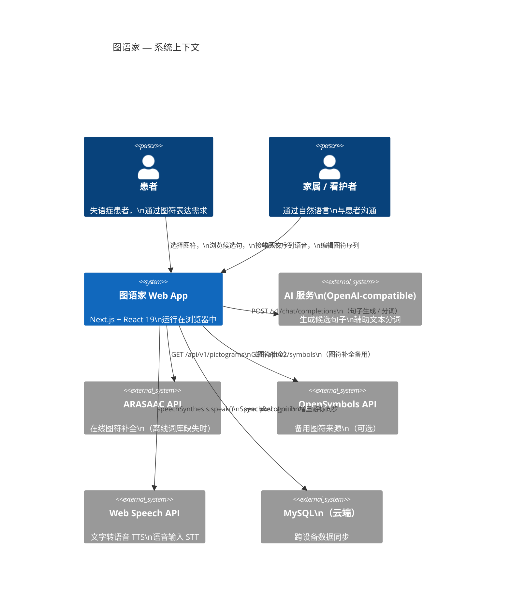
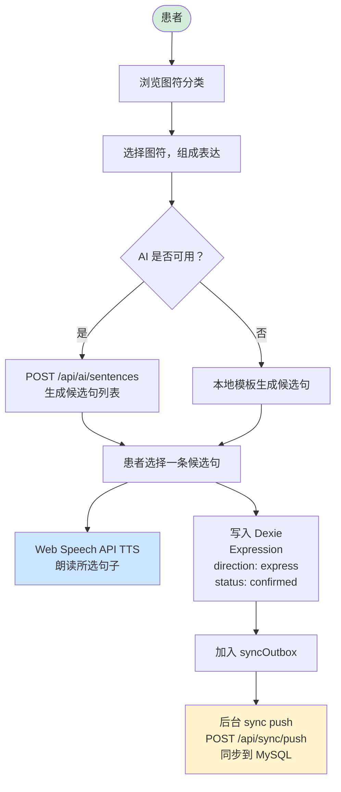
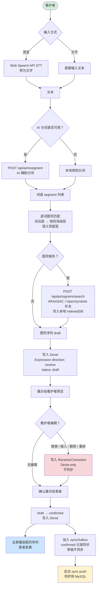
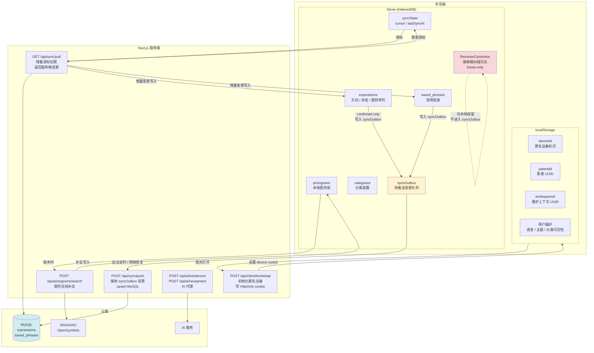
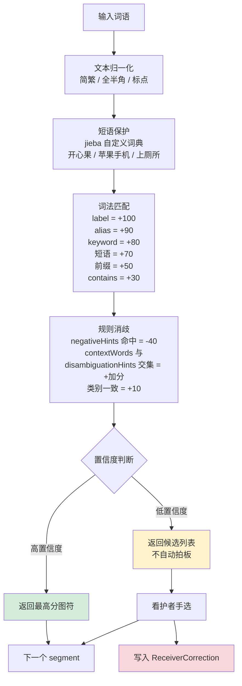

# 图语家系统架构图

更新时间：2026-05-03

---

## 1. 系统上下文图

谁在使用系统、系统依赖哪些外部服务。

---

## 2. 核心数据流图

### 2a. 表达端（患者主动表达）

患者选图 → 生成候选句 → 朗读 → 保存记录。

### 2b. 接收端（他人输入转图符序列）

看护者输入文字或语音 → 匹配图符序列 → 患者查看。

---

## 3. 数据存储与同步图

本地（Dexie + localStorage）与云端（MySQL）的结构及数据流向。

---

## 4. 图符匹配流水线（接收端核心）

详见 [symbol-matching-research.md](symbol-matching-research.md)。

---

## 5. 相关文档

| 文档 | 说明 |
|---|---|
| [README.md](../README.md) | 项目概览、环境变量、部署 |
| [ADR-001-receiver-data-model.md](ADR-001-receiver-data-model.md) | 接收端数据模型、两阶段写入、同步决策 |
| [decision-index.md](decision-index.md) | 已确认决策索引 |
| [symbol-matching-research.md](symbol-matching-research.md) | 图符匹配方案研究、消歧工具对比 |
| [prd.md](prd.md) | 产品需求文档 |
